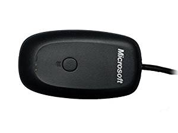

# Xbox360-wireless:

need to be installed

```Shell
$ sudo apt-gte install xboxdrv
```

You need to by an [adaptor](https://www.amazon.com/Microsoft-Xbox-Wireless-Receiver-Windows/dp/B000HZFCT2/ref=sr_1_3?ie=UTF8&qid=1532506357&sr=8-3&keywords=xbox360+wireless+adaptor&refinements=p_72%3A2661618011):


When the usb receiver was connected, check if it's detected and get ID (probably needed later):
```Shell
$ lsusb
Bus 001 Device 005: ID 045e:02a9 Microsoft Corp.
Bus ...
```

Start controller with:
```Shell
$ sudo xboxdrv --detach-kernel-driver
```

Don't forget to contect controller the fisrt time at least:


If you get an error, you can add parameter to you cmd line:
```Shell
$ sudo xboxdrv --detach-kernel-driver --device-by-id 045e:02a9 -v --type xbox360-wireless
```

If you press a button the output status of the previous line should change

```C
#include <stdlib.h>
#include <stdio.h>

int main ( void )
{
	int joystick = 0;
	Xbox360Controller pad = { 0 };

	joystick = open ( "/dev/input/js0", O_RDONLY | O_NONBLOCK );
	
	getStatus360 ( joystick, &pad, true );

	while ( getStatus360 ( joystick, &pad, false ) )
	{
		printf ( "%d\n", pad.A );
		usleep ( 50000 );
	}

	retrun ( 0 );
}
```

## Resources:
[xbox360 tutorial](https://tutorials-raspberrypi.com/raspberry-pi-xbox-360-controller-wireless/)

